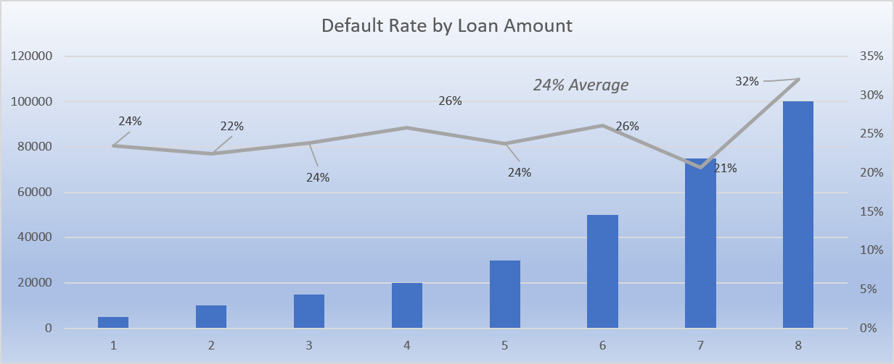

# 🏦 Kenya Fintech Risk Analysis - SQL Project

**End-to-end fintech lending risk analysis using SQL**

[](https://www.mysql.com/)
[](https://opensource.org/licenses/MIT)
[](https://github.com/bonifacekimanga/kenya-fintech-risk-analysis)

> A comprehensive SQL-based analysis of a KES 119M fintech loan portfolio, identifying risk patterns and growth opportunities through data-driven insights.

---

## 📊 Project Overview

This project analyzes 5,595 approved loans worth KES 119 million from a Kenyan fintech lending platform. Using MySQL, I performed exploratory data analysis, identified high-risk segments, and provided actionable business recommendations to reduce defaults and optimize portfolio performance.

### Key Findings

- **🔴 Critical Risk**: 100K loans default at 32.1% (8 points above average)
- **✅ Sweet Spot**: 75K loans perform best at 20.7% default rate  
- **🗺️ Regional Insight**: Kitale county shows 19% default (best performer, underutilized)
- **💰 Financial Impact**: Recommendations could prevent KES 900K-1.2M in annual losses

---

## 🎯 Business Questions Answered

1. **Portfolio Health**: What's our overall default rate and financial position?
2. **Risk Identification**: Which loan amounts have the highest default rates?
3. **Regional Performance**: Which counties are safest/riskiest for lending?
4. **Cross-Analysis**: Do certain counties handle larger loans better?

---

## 📂 Project Structure

```
kenya-fintech-risk-analysis/
│
├── 01_data_engineering/          # Initial setup scripts
├── 02_data_ingestion/            # Database creation and data loading
│   └── 01_database_setup.sql
├── 03_documentation/             # Project documentation
├── 04_analysis_queries/          # Core SQL analysis
│   ├── 02_portfolio_overview.sql
│   ├── 03_loan_amount_analysis.sql
│   ├── 04_regional_analysis.sql
│   └── 05_loan_amount_county_analysis.sql
├── 05_raw_data/                  # Original CSV files
│   ├── customers.csv
│   └── loans.csv
├── 06_findings/                  # Analysis results and visualizations
├── README.md                     # This file
└── LICENSE                       # MIT License
```

---

## 💾 Database Schema

### Customers Table
```sql
CREATE TABLE customers(
    customer_id VARCHAR(20) PRIMARY KEY,
    age INT,
    gender VARCHAR(10),
    county VARCHAR(50),
    employment_type VARCHAR(50),
    education_level VARCHAR(50),
    monthly_income DECIMAL(10,2),
    account_age_days INT,
    registration_date DATETIME
);
```

### Loans Table
```sql
CREATE TABLE loans(
    loan_id VARCHAR(20) PRIMARY KEY,
    customer_id VARCHAR(20),
    application_date DATETIME,
    loan_amount DECIMAL(10,2),
    loan_term_days INT,
    interest_rate DECIMAL(5,2),
    purpose VARCHAR(50),
    loan_status VARCHAR(20),
    approval_date DATETIME,
    disbursement_date DATETIME,
    due_date DATETIME,
    defaulted DECIMAL(3,1),
    amount_repaid DECIMAL(15,2)
);
```

---

## 📈 Key Findings


### 1. The 100K Problem 🔴

**Finding**: 100,000 KES loans have a 32.1% default rate
- 8.1 percentage points WORSE than the 24% portfolio average
- 106 loans affected
- **Annual exposure**: KES 900K-1.2M in losses

**Recommendation**: 
- Cap maximum loan amount at 75K
- OR require co-signer/additional collateral for 100K+ loans
---

## 📊 Key Findings Visualized

### Default Rate by Loan Amount



**Critical Finding**: The chart clearly shows the "100K problem" - loans of 100,000 KES (position 8) have a default rate of 32%, significantly higher than the 24% portfolio average. Meanwhile, 75K loans (position 7) perform well at 21%, making them the ideal maximum loan size.

**Key Observations**:
- 📈 Default rates increase with loan size
- 🔴 100K loans are 8 percentage points above average
- ✅ 75K and below maintain acceptable risk levels
- 💡 Clear inflection point at 100K threshold

---

**SQL Query**:
```sql
SELECT 
    loan_amount,
    COUNT(*) as total_loans,
    ROUND(AVG(defaulted) * 100, 1) as default_rate
FROM loans
WHERE loan_status = 'Approved'
GROUP BY loan_amount
ORDER BY default_rate DESC;
```

---

### 2. Sweet Spot: 75K Loans ✅

**Finding**: 75,000 KES loans perform exceptionally well
- 20.7% default rate (3.3 points BETTER than average)
- 299 loans in portfolio (good volume)
- Consistently outperforms across most counties

**Recommendation**:
- Make 75K the new standard maximum loan size
- Promote as "safe growth" product

---

### 3. Regional Champions: Kitale County 🏆

**Finding**: Kitale shows the lowest default rate (19.0%)
- 5 percentage points better than average
- Only 226 loans (severely underutilized!)
- Performs exceptionally well on 20K-75K loans

**Recommendation**:
- Launch "Kitale Growth Initiative"
- Target 20K-75K loan products
- Goal: Grow from 226 to 500+ loans in 12 months

**SQL Query**:
```sql
SELECT 
    c.county,
    COUNT(*) as total_loans,
    ROUND(AVG(l.defaulted) * 100, 1) as default_rate
FROM loans l
JOIN customers c ON l.customer_id = c.customer_id
WHERE l.loan_status = 'Approved'
GROUP BY c.county
ORDER BY default_rate;
```

---

### 4. Cross-Analysis: County × Loan Amount

**Critical Findings**:
- **🚨 Danger**: 100K loans in small counties (Malindi, Kitale) default at 50%!
- **✅ Opportunity**: Kitale 20K loans default at only 8.3% (AMAZING!)
- **💰 Volume**: Nairobi 10K loans (427 volume) at 19.9% default

**Recommendation**: Implement county-specific loan caps
- Nairobi/Mombasa: Up to 100K (with caution)
- Mid-size counties: Cap at 75K
- Small counties: Case-by-case for 75K+

---

## 🎯 Strategic Recommendations Summary

| Action | Impact | Priority |
|--------|--------|----------|
| Cap 100K loans at 75K | Prevent KES 900K-1.2M losses | 🔴 Critical |
| Grow Kitale 20K-75K products | KES 20M+ new portfolio at <10% default | 🟢 High |
| Expand Nairobi 10K-75K | Scale proven safe market | 🟢 High |
| Tighten criteria in Thika/Eldoret | Reduce 26%+ default rates | 🟡 Medium |
| County-specific loan caps | Tailored risk management | 🟡 Medium |

---

## 🛠️ Technologies Used

- **Database**: MySQL 8.0
- **Tools**: MySQL Workbench, GitHub Desktop
- **Skills Demonstrated**:
  - Database design and schema creation
  - Complex SQL queries (JOINs, GROUP BY, aggregations)
  - Multi-dimensional analysis
  - Business intelligence and data storytelling

---

## 🚀 How to Run This Analysis

### Prerequisites
- MySQL 8.0 or higher
- MySQL Workbench (optional, for GUI)

### Setup Instructions

1. **Clone the repository**
```bash
git clone https://github.com/bonifacekimanga/kenya-fintech-risk-analysis.git
cd kenya-fintech-risk-analysis
```

2. **Create the database**
```bash
mysql -u root -p < 02_data_ingestion/01_database_setup.sql
```

3. **Load the data**
- Use MySQL Workbench's Table Data Import Wizard
- Import `05_raw_data/customers.csv` into `customers` table
- Import `05_raw_data/loans.csv` into `loans` table

4. **Run the analysis queries**
```bash
mysql -u root -p kenya_fintech < 04_analysis_queries/02_portfolio_overview.sql
mysql -u root -p kenya_fintech < 04_analysis_queries/03_loan_amount_analysis.sql
mysql -u root -p kenya_fintech < 04_analysis_queries/04_regional_analysis.sql
mysql -u root -p kenya_fintech < 04_analysis_queries/05_loan_amount_county_analysis.sql
```

---

## 📊 Sample Results

### Portfolio Overview
```
Total Loans: 5,595
Total Lent: KES 119,185,000
Total Repaid: KES 97,909,305
Default Rate: 24.0%
Recovery Rate: 82.2%
```

### Top Risk: Loan Amounts
```
100K: 32.1% default rate (WORST)
 50K: 26.1% default rate
 20K: 25.9% default rate
 75K: 20.7% default rate (BEST)
```

### Regional Performance
```
Kitale:  19.0% default (BEST)
Nairobi: 22.8% default (High volume + good)
Thika:   26.8% default (WORST)
```

---

## 📚 What I Learned

This project demonstrates my ability to:

✅ **Design relational databases** with proper data types and constraints  
✅ **Write complex SQL queries** including JOINs, aggregations, and multi-dimensional analysis  
✅ **Translate business questions** into actionable SQL queries  
✅ **Identify patterns in data** through exploratory analysis  
✅ **Communicate insights** with clear documentation and recommendations  
✅ **Think like a data engineer** with proper project structure and workflow  

---

## 👤 About Me

**Boniface Kimanga Mwangi**  
Data Analyst | SQL | Excel | Python

- 📧 Email: [kimangaboniface79@gmail.com](mailto:kimangaboniface79@gmail.com)
- 💼 LinkedIn: [linkedin.com/in/boniface-kimanga](https://www.linkedin.com/in/boniface-kimanga)
- 🐱 GitHub: [github.com/bonifacekimanga](https://github.com/bonifacekimanga)

---

## 📄 License

This project is licensed under the MIT License - see the [LICENSE](LICENSE) file for details.

---

## 🙏 Acknowledgments

- Dataset: Synthetic fintech loan data based on Kenyan lending patterns
- Analysis conducted as part of data analyst portfolio development
- Inspired by real-world fintech risk analytics challenges

---

**⭐ If you found this project useful, please consider giving it a star!**